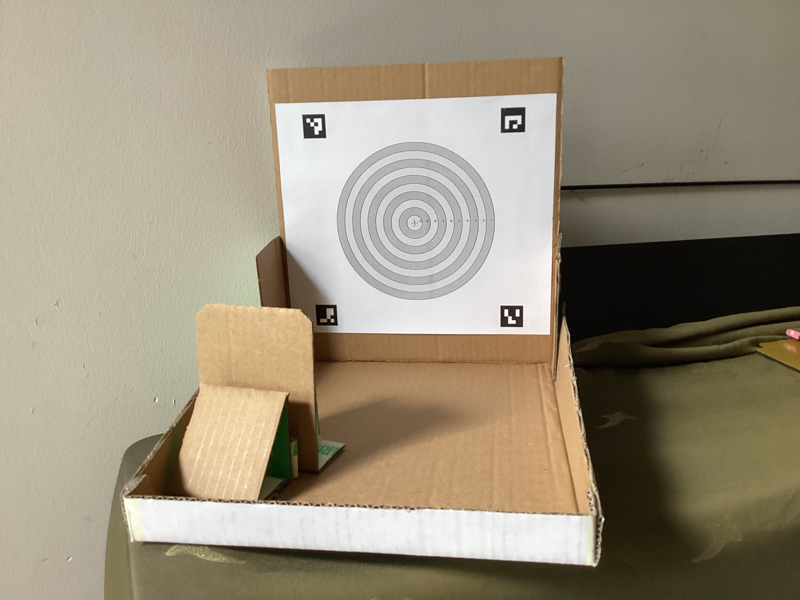
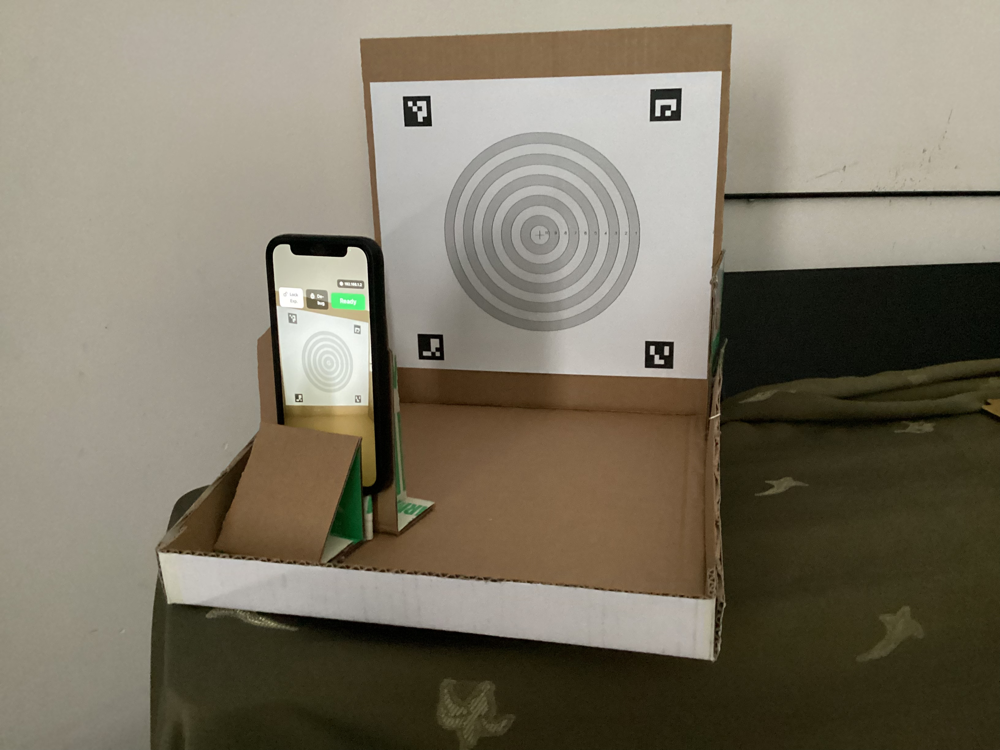
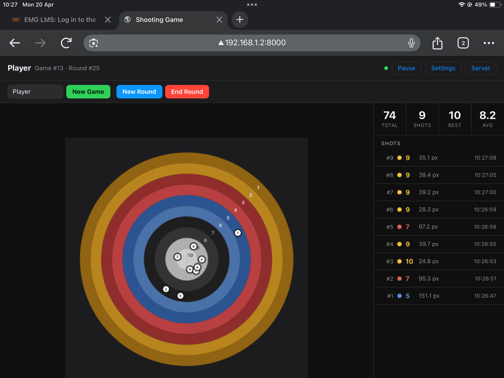
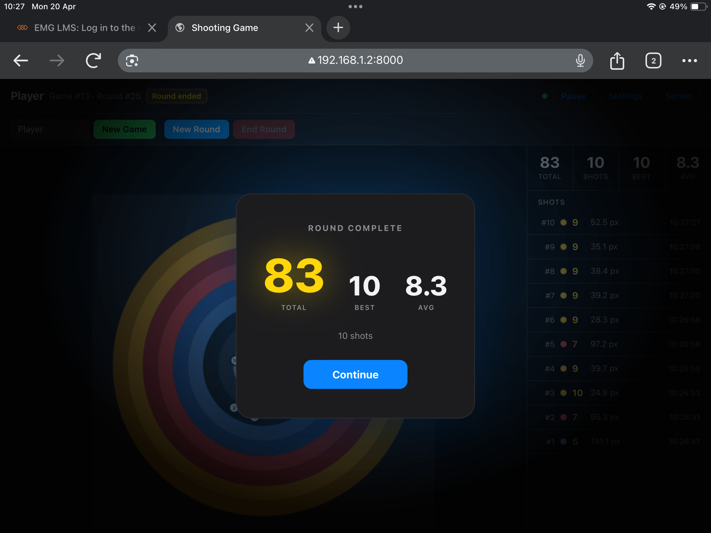

# Laser Shooting Game

A DIY laser pointer shooting game with real-time dot detection. Point a laser pointer at a printed target board — the system detects the hit, scores it, and displays results on a live scoreboard.

## Components

| Component | Tech | Purpose |
|-----------|------|---------|
| `ios/` | Swift / SwiftUI | Camera app — detects the laser dot and sends frames to the backend |
| `backend/` | Python / FastAPI | CV pipeline — ArUco board detection, red dot scoring, REST API |
| `frontend/` | HTML / JS | Web scoreboard — shows live scores, controls games and rounds |
| `cv/` | Python / OpenCV | Offline tools — board generator and standalone detection scripts |

## Hardware Required

- A printed target board (`cv/board_print.png`) mounted on a flat surface
- An iPhone (rear ultra-wide camera, iOS 16+)
- A red laser pointer
- A Mac or server on the same Wi-Fi network to run the backend

## Quick Start

### 1. Print the board

Print `cv/board_print.png` at A3 or larger. The four ArUco markers in the corners are required for perspective correction.

### 2. Start the backend

```bash
cd backend
pip install -r requirements.txt
uvicorn main:app --host 0.0.0.0 --port 8000
```

The server logs its local IP on startup:
```
INFO  Local IP: 192.168.x.x  →  http://192.168.x.x:8000
```

### 3. Open the web scoreboard

Open `http://192.168.x.x:8000` in a browser. Create a game and start a round from the header controls.

### 4. Set up the iPhone app

- Build and install the Xcode project in `ios/shooting-game/`.
- Enter the backend URL shown in step 2.
- Frame the board in the camera view, tap **Lock Exp.** to freeze exposure, then tap **Ready**.

### 5. Shoot

Fire the laser at the board. The app detects the dot, sends the frame to the backend for scoring, and the result appears on both the phone and the web scoreboard.

## Backend API

| Method | Path | Description |
|--------|------|-------------|
| `GET` | `/current` | Current game + round state |
| `POST` | `/games` | Create a new game |
| `GET` | `/games/{id}` | Game detail with rounds |
| `POST` | `/games/{id}/rounds` | Start a new round |
| `PATCH` | `/rounds/{id}/end` | End a round |
| `GET` | `/rounds/{id}` | Round detail with shots |
| `POST` | `/detect` | Detect shot (auto-finds active round) |
| `POST` | `/rounds/{id}/detect` | Detect shot for a specific round |
| `POST` | `/debug/detect` | Full pipeline diagnostics (no DB write) |

## Scoring

The board has 10 concentric rings. Ring 1 (outermost) = 1 point, Ring 10 (bullseye) = 10 points. Shots outside all rings score 0.

## Detection Pipeline

1. **iOS** — scans every camera frame for bright red pixel clusters using a ratio-based filter (`R / max(G,B) ≥ 1.5`, `R ≥ 160`)
2. **Backend** — receives the JPEG + iOS hint coordinates, runs ArUco marker detection to compute a homography, warps the board to a flat 800×800 canvas, then detects the red dot via HSV masking with morphological cleanup
3. **Fallbacks** — relaxed HSV search around the iOS hint, then a brightness-peak search for heavily overexposed dots

## Debug

When a shot is missed, debug images are saved to `backend/debug/`:
- `no_dot_*.jpg` — annotated warped board + HSV mask showing why detection failed
- `mismatch_*.jpg` — iOS and backend positions disagree
- `debug_raw_*.jpg` — raw frame received via the `/debug/detect` endpoint

The iOS app has a **Debug** button (ladybug icon) that captures a frame and sends it to `/debug/detect`, displaying the annotated pipeline result inline.

## Images

**Target board and phone holder** — cardboard stand positions the iPhone at a fixed angle facing the board



**Setup in use** — iPhone mounted in the holder, board framed in the camera view, ready to shoot



**Live scoreboard** — web frontend showing shot positions on the target and a per-shot breakdown



**Round complete splash** — summary shown automatically after the last shot of a round

